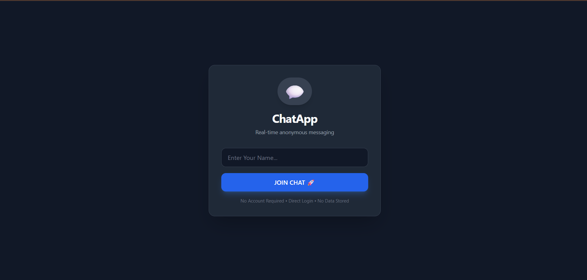
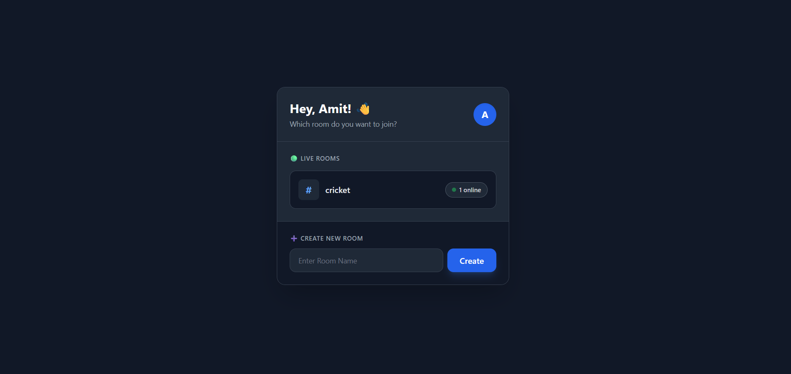
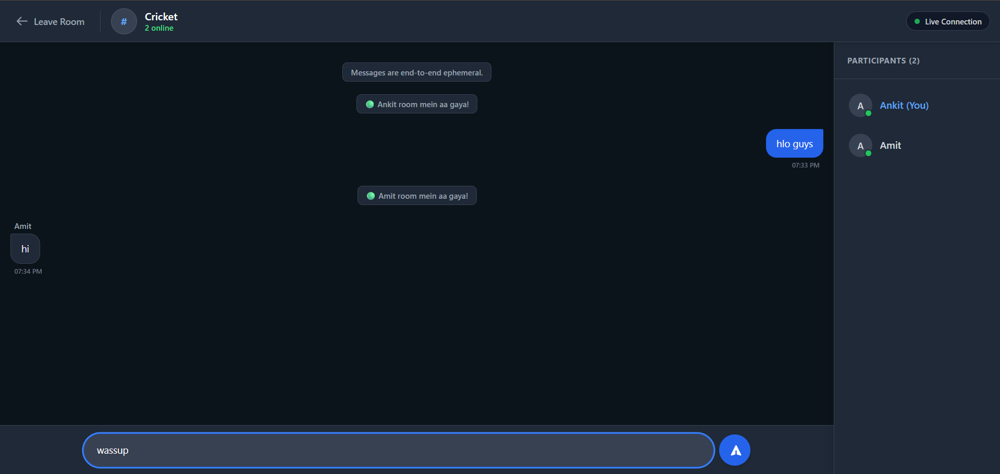

# Real-Time Anonymous ChatApp 🚀

## 📸 Screenshots

Login Screen
<br>


Room List Interface
<br>


Main Chat Interface 
<br>

 
---

## ✨ Features
- **Real-Time Messaging**: Instant delivery of messages via bi-directional WebSockets.
- **Anonymous Architecture**: No accounts, no database, no stored data.
- **Live Room System**: Create a room, share the name, and chat with up to 50 active users per room.
- **Modern UI**: Polished TailwindCSS design with responsive layouts and dark-mode aesthetics.
- **Secure**: Features built-in limits against payload spamming and memory exhaustion.

## 🛠️ Tech Stack
**Frontend:**
- React 19
- Vite
- TailwindCSS

**Backend:**
- Python 3
- FastAPI
- Uvicorn (ASGI)
- WebSockets

---

## 🚀 Setting Up the Project Locally

Clone the repository to your local machine:
```bash
git clone https://github.com/yourusername/chatapp.git
cd chatapp
```

### 1. Backend Setup
Navigate to the backend directory and set up your virtual environment:

```bash
cd backend
python -m venv venv

# On Windows:
venv\Scripts\activate

# On Mac/Linux:
source venv/bin/activate
```

Install the required Python dependencies:
```bash
pip install -r requirements.txt
```

Start the FastAPI server:
```bash
uvicorn main:app --reload
```
The backend API will run on `http://localhost:8000`

### 2. Frontend Setup
Open a new terminal window and navigate to the frontend directory:

```bash
cd frontend
npm install
```

Start the frontend development server:
```bash
npm run dev
```
The React frontend will be accessible at `http://localhost:5173`

---

## 🔒 Environment Configuration 
For production deployment, you can customize the connection URLs by modifying the frontend code or injecting environment variables (e.g., `VITE_API_BASE_URL` and `VITE_WS_BASE_URL`).

## 📜 License
This project is open-source and available under the MIT License.
