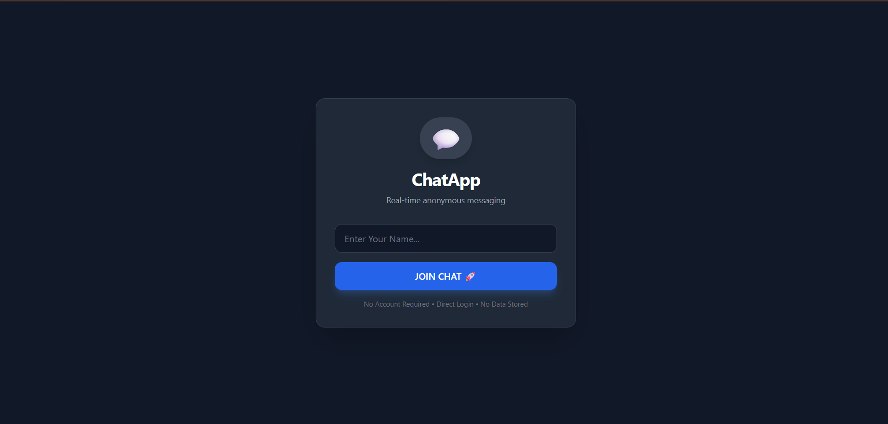
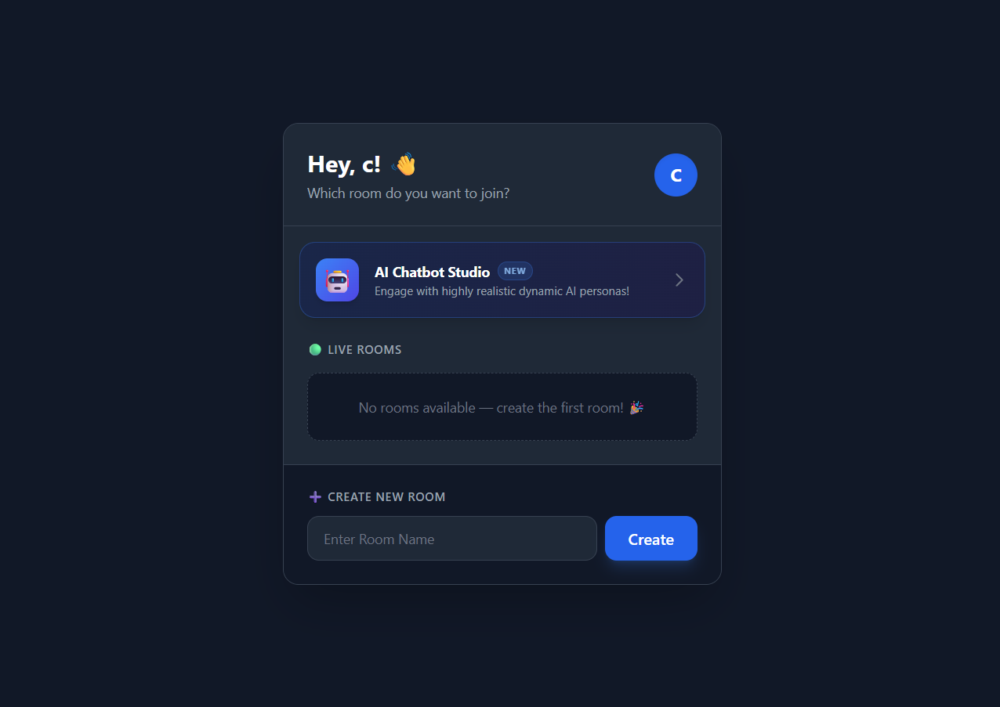
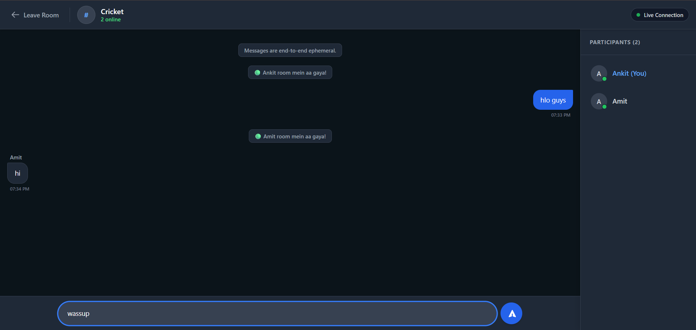
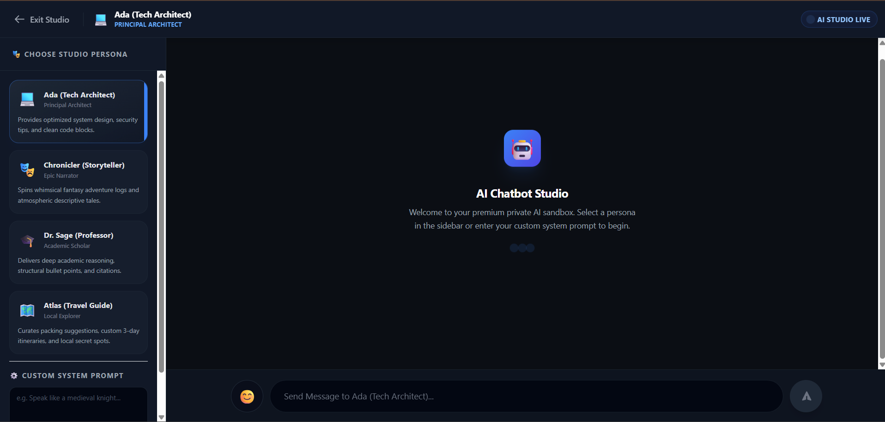

# 💬 Real-Time Anonymous ChatApp with AI Chatbot Studio

[](LICENSE)

A full-stack, real-time anonymous chat application and interactive AI playground built with **FastAPI** (Python) and **React** (Vite + TailwindCSS). Enjoy seamless multiplayer chat rooms or dive into the single-player **AI Chatbot Studio** featuring highly realistic, dynamic AI personas powered by Google Gemini and OpenRouter.

---

## 📸 Screenshots

### Login Screen
<br>


### Room List & AI Chatbot Studio Entry
<br>


### Main Chat Interface
<br>


### AI Chat Interface
<br>


---

## ✨ Features

- **Real-Time Messaging** — Instant communication via WebSockets with zero page reloads.
- **AI Chatbot Studio 🤖** — Engage 1-on-1 with unique, highly-realistic AI personas:
  - **Ada (Tech Architect)** 💻 — Deep system designs and optimized code blocks.
  - **Chronicler (Storyteller)** 🎭 — Whimsical fantasy adventures and atmospheric narration.
  - **Dr. Sage (Professor)** 🎓 — Intellectual, analytical reasoning and structural citations.
  - **Atlas (Travel Guide)** 🗺️ — Curated itineraries, packing tips, and local secrets.
  - **Dynamic Persona Generator** ⚙️ — Write your own custom system prompt and instantly converse with a tailor-made AI.
- **Anonymous Architecture** — Truly ephemeral. No accounts, no database, no stored messages.
- **Multi-Room System** — Create any room instantly and share the name to invite others.
- **Live User List** — Active participant rosters updated in real-time in the chat sidebar.
- **Micro-Animations & Typing Indicators** — Real-time typing states for both human users and AI bots.
- **Security & Performance Safeguards** — Rigorous validation checks for username/room lengths, maximum connections, message payload sizes, and connection limits.
- **CI Pipeline** — Automated backend checks and full frontend Vite builds on every push via GitLab CI.

---

## 🛠️ Tech Stack

| Layer | Technology |
|-------|-----------|
| **Frontend** | React 19, Vite, TailwindCSS, Native WebSockets |
| **Backend** | Python 3.11+, FastAPI, Uvicorn (ASGI), HTTPX |
| **AI Integrations** | OpenRouter API (Llama, Claude, DeepSeek) & Google Gemini API |
| **Deployment** | Vercel (Frontend) + Render (Backend) |
| **CI/CD** | GitLab CI (automated quality checks & syntax verification) |

---

## 🚀 Deployed App

| Service | URL |
|---------|-----|
| Frontend (Vercel) | *Your Vercel URL here* |
| Backend (Render) | *Your Render URL here* |

---

## 🔒 Security & Limits

| Guard / Limit | Details |
|-----------|---------|
| **Username Length** | Max 20 characters (strictly enforced on server) |
| **Room Name Length** | Max 20 characters (strictly enforced on server) |
| **Message Payload Size** | Max 500 characters per message |
| **Max Users Per Room** | Up to 50 active users |
| **Max Total Active Rooms** | Up to 500 concurrent rooms |
| **CORS Policy** | Custom FastAPI CORS middleware for safe cross-origin resource sharing |

---

## 📁 Project Structure

```
chatapp/
├── backend/
│   ├── main.py              # FastAPI application — WebSockets, rooms, and AI persona routes
│   ├── .env.example          # Template for API credentials
│   ├── .env                 # Local API keys (excluded from Git)
│   └── requirements.txt     # Python backend dependencies
├── frontend/
│   ├── src/
│   │   ├── App.jsx           # Root controller — application routing & state management
│   │   ├── App.css           # Custom styling and micro-animations
│   │   ├── index.css         # TailwindCSS directives
│   │   └── components/
│   │       ├── UsernameScreen.jsx  # Elegant name registration screen
│   │       ├── RoomList.jsx        # Room browser + AI Chatbot Studio gateway
│   │       ├── ChatScreen.jsx      # High-performance live room chat UI
│   │       └── AIChatScreen.jsx    # Premium AI sandbox with persona picker & custom prompts
│   ├── .env.example          # Frontend API connection template
│   ├── package.json          # Node dependencies and scripts
│   └── vite.config.js        # Vite compilation settings
├── .gitlab-ci.yml            # GitLab CI pipeline definition
├── .gitignore                # Version control exclusions
└── README.md                 # Project documentation
```

---

## 🧠 How It Works

### 👥 Room Chat Mode
1. Users provide a username and select or create a chat room.
2. A persistent WebSocket connection is established with the FastAPI backend at `/ws/{room_name}/{username}`.
3. FastAPI maintains an active in-memory map of connections.
4. Sent messages are parsed, validated, and instantly broadcasted to all active participants in the respective room.
5. All data is ephemeral — when the last participant leaves, the room is safely garbage-collected.

### 🤖 AI Chatbot Studio
1. Users select a predefined AI persona or enter a custom prompt.
2. A specialized WebSocket is opened with `/ws/ai/{persona_id}/{username}`.
3. The server sets up system instructions and uses **HTTPX** to stream requests to the **OpenRouter** or **Gemini** API.
4. While the model is processing, the server pushes `type: "typing"` messages to render an interactive loading animation.
5. The response is parsed for markdown format (like bolding, italics, or code snippets) and rendered inside the chat log.
6. Local mock fallbacks are ready to simulate realistic conversations if API keys are not provided.

---

## ⚙️ Local Development Setup

### Prerequisites
- Python 3.11+
- Node.js 20+

### 1. Clone the Repository

```bash
git clone https://github.com/Praveen869/Realtime_chat_app.git
cd chatapp
```

### 2. Backend Configuration & Setup

1. Navigate to the backend directory and set up your environment variables:
   ```bash
   cd backend
   cp .env.example .env
   ```
2. Open `.env` and enter your API credentials (at least one key is recommended for live AI responses):
   ```env
   OPENROUTER_API_KEY=your_openrouter_api_key_here
   GEMINI_API_KEY=your_gemini_api_key_here
   ```
3. Initialize the Python virtual environment and run the server:
   ```bash
   # Create Virtual Environment
   python -m venv venv

   # Activate Virtual Environment
   # Windows:
   venv\Scripts\activate
   # Mac/Linux:
   source venv/bin/activate

   # Install Dependencies
   pip install -r requirements.txt

   # Start the FastAPI Server
   uvicorn backend.main:app --reload
   ```

Backend will run at: `http://localhost:8000`
*Test verification*: Open `http://localhost:8000/` in your browser. It should return `{"message": "Server is working!"}`.

---

### 3. Frontend Setup

Open a **new terminal window** and run the following commands:

```bash
cd chatapp/frontend
npm install
npm run dev
```

Frontend will run at: `http://localhost:5173`

---

### 4. Environment Variables (Optional for Local)

Copy the frontend environment template:
```bash
cp frontend/.env.example frontend/.env
```

For local development, the default endpoints are pre-configured to target `localhost:8000`, so no edits are needed.

For production, specify these configuration variables in your hosting provider's dashboard:
```env
VITE_API_BASE_URL=https://your-render-url.onrender.com
VITE_WS_BASE_URL=wss://your-render-url.onrender.com
```

---

## 🔄 GitLab CI Pipeline

Every push to the `main` branch triggers a dual-stage automated verification pipeline:

```
Stage 1: check
  └── backend  → Sets up Python environment and runs syntax checks on main.py

Stage 2: build
  └── frontend → Installs dependencies and runs full production Vite bundle build
```

View active pipelines here: [GitLab → Build → Pipelines](https://gitlab.com/praveen869-group/chatapp/-/pipelines)

---

## 📜 License

This project is licensed under the terms of the [MIT License](LICENSE).
